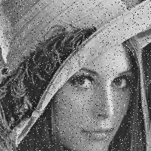

# Parallel-Median-filter
The median filter is a nonlinear digital filtering technique, often used to remove  noise from an image or signal. Such noise reduction is a typical pre-processing  step to improve the results of later processing.

## Images

